## 二维向量绘图

### 二维向量绘图

**练习2.1：**恐龙脚趾尖上的点的X坐标和y坐标是什么？

**练习2.2：**在平面上画出点(2,-2)和与之对应的箭头

**练习2.3：**通过观察恐龙各点的位置，推断dino_vectors列表未包含的其余向量。例如，列表已经包含了恐龙尾巴尖上的点(6, 4)，但不包含恐龙鼻子上的点(-5, 3)。完成后，dino_vectors列表中应该有由21个坐标对表示的向量。

**练习2.4：**构建一个以dino_vectors为顶点的Polygon对象，画出将每个点相连的恐龙图像（见图2-11）。
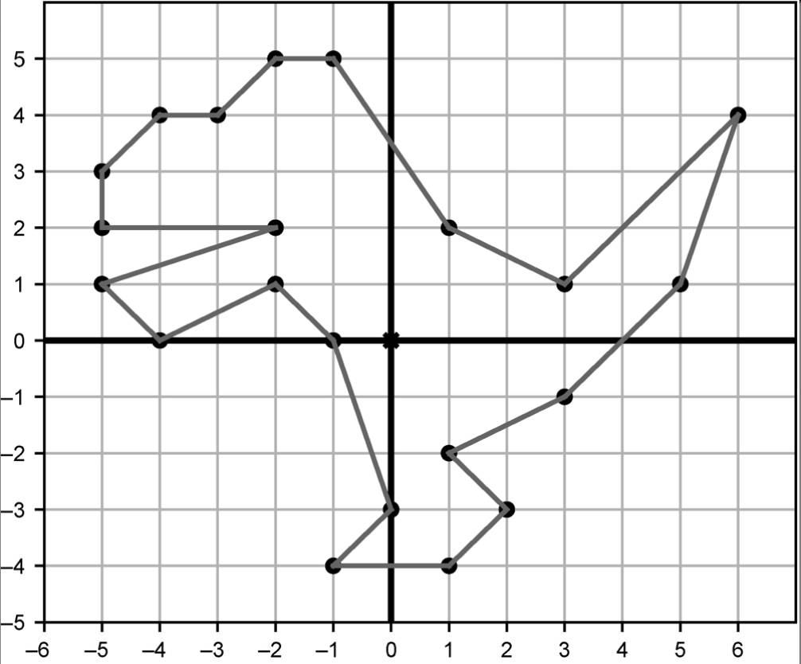

**练习2.5：**当X坐标在-10到10的范围内时，使用draw函数绘制表示向量(x, x**2)的点。

### 平面向量运算

**练习2.6：**对于向量u=(-2,0)、向量v=(1.5,1.5)和向量w=(4,1)，u + v、v + w和u + w的结果是什么？u + v + w的结果又是什么？

**练习2.7：**通过将所有向量各自的X坐标和Y坐标相加，可以实现任意数量的向量相加。例如，向量和(1, 2) + (2, 4) + (3, 6) + (4, 8)有X分量1 + 2 + 3 + 4 = 10与Y分量2 + 4 + 6 + 8 = 20，结果为(10, 20)。实现新的add函数，接收任意多个向量作为参数。

**练习2.8：**实现函数translate(translation, vectors)，接收一个平移向量和一个向量列表，返回一个根据平移向量平移后的向量列表。例如，对于translate ((1,1), [(0,0), (0,1,), (-3,-3)]) ，它应该返回[(1,1),(1,2), (-2, -2)]。

**练习2.9（小项目）：**向量之和v + w与w + v结果相同。用坐标形式的向量和的定义来解释其原因。同时，用图像来说明为什么这在几何上是成立的。

**练习2.10：**在如图2-28所示的三个箭头向量（标为u、v和w）中，哪一对的和对应的箭头**最长**？哪一对的和对应的箭头最**短**？
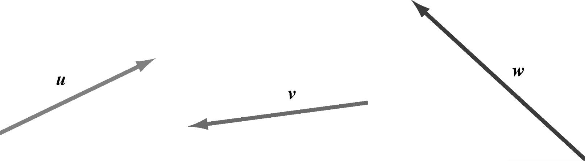

**练习2.11（小项目）：**实现一个处理向量加法的Python函数，显示100个相互不重叠的恐龙图像。这体现了计算机图形学的威力。想象一下，手绘2100个坐标对是一件多么乏味的事情！

**练习2.12：**对于(3, -2) + (1, 1) + (-2, -2)，是X分量还是Y分量更长？

**练习2.13：**向量(-6, -6)和(5, -12)的分量和长度分别是多少？

**练习2.14：**假设有一个长为6的向量v和它的X分量(1, 0)。v的坐标可能是什么？

**练习2.15：**dino_vectors列表中哪个向量的长度最长？用我们实现的length函数快速计算出答案。

**练习2.16：**假设向量w的坐标是(√2,√3)。那么π * w的坐标近似值是多少？画出原向量和新向量。

**练习2.17：**写一个Python函数scale(s,v)，将输入向量v和输入标量s相乘。

**练习2.18（小项目）：**用代数方法证明，将坐标按照一个系数缩放，会将向量的长度以同等系数缩放。假设一个长度为c的向量坐标为O。证明，对于任意非负实数s，(s * a,s * b)的长度是s * c。（s不能是负值，因为向量的长度不可能为负。）

**练习2.19（小项目）：**假定z=(-1,1)和v=(1,1)，而r和s是实数，并且假设-3 < r < 3且-1 < s < 1。在平面上，向量r * z + s * v可能的终点是哪里？请注意，向量的运算顺序和数的运算顺序一致。我们假设先进行标量乘法，然后进行向量加法（除非有括号）。

**练习2.20：**用代数法证明为什么一个向量和其负向量具有相同的长度。

**练习2.21：**在如图2-33所示的七个用箭头表示的向量中，哪两个是一对相反的向量？
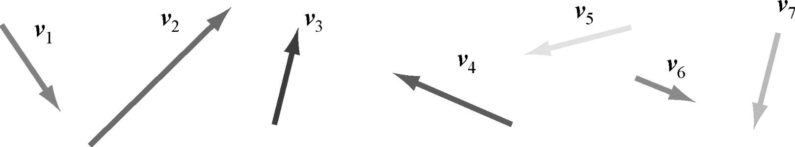

**练习2.22：**假定u是任意二维向量。u + (-u)的坐标是什么？

**练习2.23：**对于向量u=(-2,0)、v=(1.5,1.5)和w=(4,1)，v - w、z - v和w - v的结果分别是什么？

**练习2.24：**实现Python函数subtract(v1,v2)，返回v1 - v2的结果。该函数接收两个二维向量作为输入，返回一个二维向量作为输出。

**练习2.25：**实现Python函数distance(v1,v2)，返回两个输入向量之间的距离。（注意：上一个练习中的subtract函数已经返回了两个向量之间的位移。）

**练习2.26（小项目）：**令u为向量(1, -1)。假定有另一个正整数坐标为(n,m)（n > m）的向量v，且它与u的距离为13，那么从u到v的位移是多少？

### 平面上的角度和三角学

**练习2.27：**确认笛卡儿坐标(-1.34, 2.68)对应的向量的长度约为3。

**练习2.28：**图2-45中是一条从X正半轴开始按逆时针方向旋转22°角的直线。根据图2-45，tan(22°)的近似值是多少？
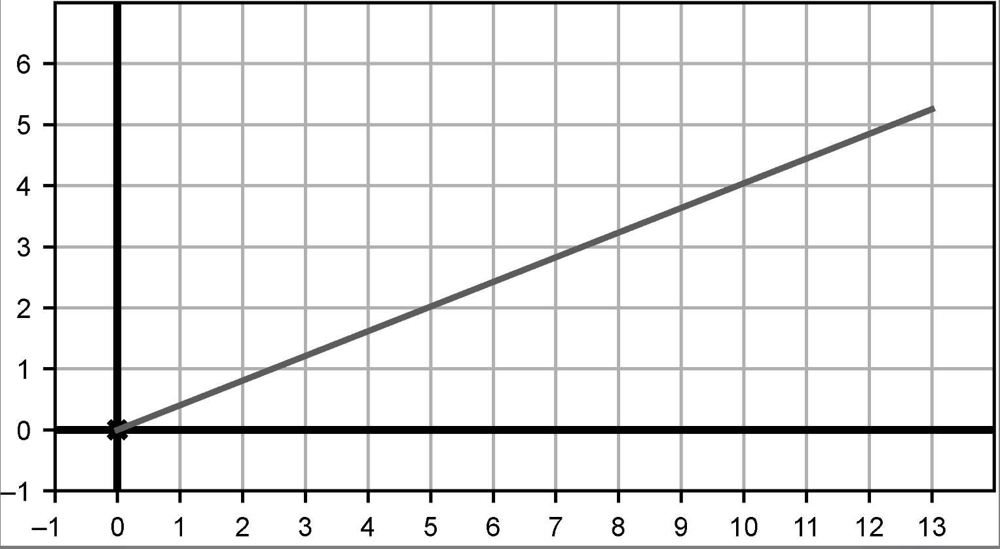

**练习2.29：**转换问题的角度，假设我们知道了一个向量的长度和方向，想找到它的分量该如何做呢？一个长度为15的向量指向37°角，其X分量和Y分量是多少？

**练习2.30：**假设从原点出发，沿着从X轴正半轴逆时针旋转125°的方向移动8.5个单位，那么最终坐标是什么？已知sin(125°)=0.819、cos(125°)=-0.574，请画图来表示走过的角度和路径。

**练习2.31：**0°、90°和180°的正弦和余弦各是多少？换句话说，在这些方向上，每单位距离经过多少个垂直和水平单位？

**练习2.32：**图2-48对于一个直角三角形给出了一些精确的测量数据。首先，确认这些长度在直角三角形中的有效性，因为它们必须满足勾股定理。然后，用图中的数据计算sin(30°)、cos(30°)和tan(30°)的值，精确到小数点后三位。
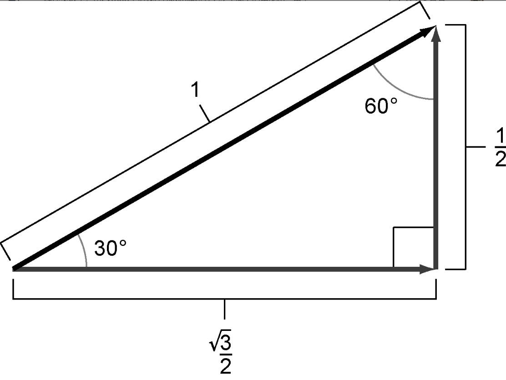

**练习2.33：**从另一个角度观察上一个练习中的三角形，用它计算sin(60°)、cos(60°)和tan(60°)的值，精确到小数点后三位。

**练习2.34：**已知50°的余弦值是0.643。sin(50°)的值是多少，tan(50°)的值又是多少？通过画图来计算。

**练习2.35：**116.57°对应的弧度是多少？用Python计算这个角的正切值，并确认它约等于-2。

**练习2.36：**cos(10π/6)和sin(10π/6)的值为正还是为负？使用Python计算它们的值并确认。

**练习2.37：**用下面的列表推导式创建1000个极坐标对应的点。

**练习2.38：**通过“猜测检查法”（guess-and-check）找出(-2, 3)对应的弧度（见图2-52）。
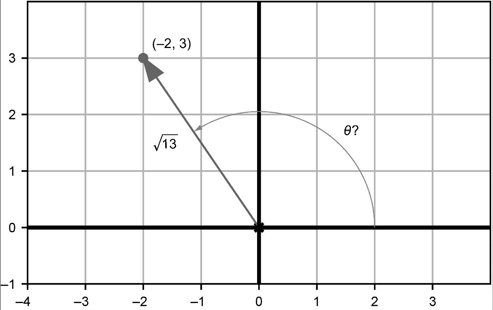

**练习2.39：**在平面上找到另一个与θ有相同正切值（即-3/2）的点。使用Python的反正切函数math.atan来求这个点的弧度值。

**练习2.40：**不使用Python，算出笛卡儿坐标(1, 1)和(1, -1)对应的极坐标。找到答案之后，使用to_polar来检查一下。

**练习2.41（小项目）：**如图2-53所示，恐龙嘴巴的夹角是多少？脚趾的夹角是多少？尾巴的夹角是多少？
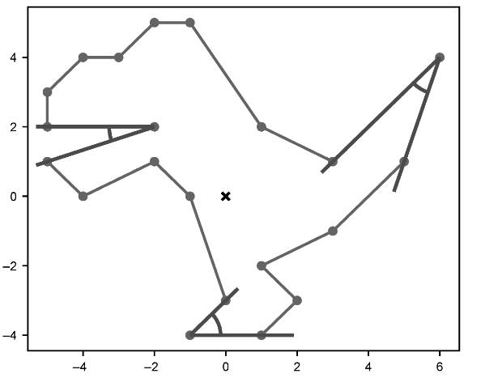

### 向量集合的变换

**练习2.42：**实现rotate(angle, vectors)函数，接收笛卡儿坐标向量数组，并将这些向量旋转指定的角度（根据角度的正负来确定是逆时针还是顺时针）。

**练习2.43：**实现函数regular_polygon(n)，返回一个规则n边形（即所有角和边长都相等）各顶点的笛卡儿坐标。例如，polygon(7)返回如图2-57所定义七边形的顶点向量。
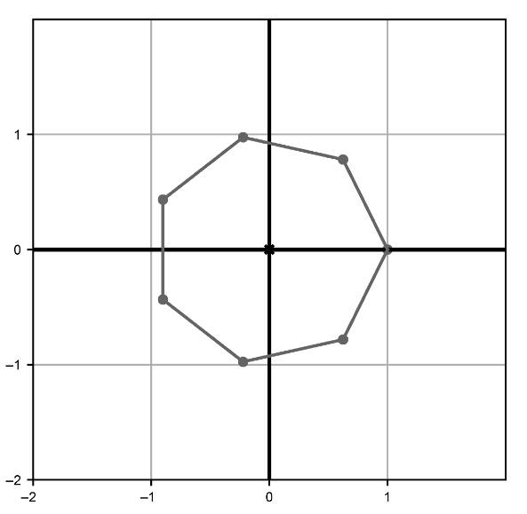

**练习2.44：**先将恐龙按向量(8, 8)平移，再将其旋转5π/3（见图2-58），结果是什么？和先旋转再平移的结果一样吗？
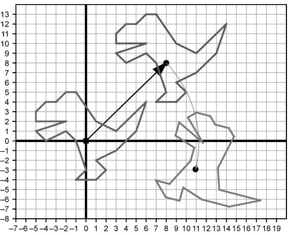

## 上升到三维世界

### 在三维空间中绘制向量

**练习3.1：**绘制表示坐标(-1, -2, 2)的点和三维箭头，以及使箭头更立体的虚线框。可以手动绘制来进行练习，不过从现在开始，我们将使用Python来绘图。

**练习3.2（小项目）：**有8个三维向量的坐标都是+1或-1。例如，(1, -1, 1)就是其中之一。将这8个向量绘制成点。然后想办法通过Segment3D对象用线段将它们连接到一起，以形成立方体的轮廓。

### 三维空间中的向量运算

**练习3.3：**将(4, 0, 3)和(-1, 0, 1)绘制为Arrow3D对象，使它们在三维空间中以两种顺序首尾相接。它们的向量和是多少？

**练习3.4：**假设设置vectors1= [ (1,2,3,4,5), (6,7,8,9,10) ]和vectors2=[ (1,2), (3,4), (5,6) ]。在不使用Python求值的情况下，zip(*vectors1)和zip(*vectors2)的长度分别是多少？

**练习3.5（小项目）：**下面的代码创建了一个包含24个Python向量的列表。

~~~python
form math import sin, cos, pi
vs = [(sin(pi * t/6), cos(pi * t/6), 1.0/3) for t in range(0, 24)]
~~~

这24个向量的和是多少？把这24个向量绘制成首尾相接的Arrow3D对象。

**练习3.6：**编写函数scale(scalar,vector)，返回输入标量乘以输入向量的结果。具体地说，这个函数要同时适用于二维和三维向量，以及有任意多坐标的向量。

**练习3.7：**设u=(1,-1,-1)和v=(0,0,2)。u +1/2(v - u)的结果是什么？

**练习3.8：**试着在不使用代码的情况下找到这个练习的答案，然后检查你的答案是否正确。二维向量(1, 1)的长度是多少？三维向量(1, 1, 1)的长度是多少？我们还没有讨论到四维向量，但是它们有四个坐标，而不是两个或三个。猜一下，坐标为(1, 1, 1, 1)的四维向量的长度是多少？

**练习3.9（小项目）：**坐标3、4和12能以任意顺序创建一个向量，其长度是整数13。这很不寻常，因为大多数数不是完全平方数，所以长度公式中的平方根通常返回无理数。找出另一组三个整数，以它们为坐标定义的向量也有整数长度。

**练习3.10：**找到一个与(-1, -1, 2)方向相同但长度为1的向量。

### 点积：测量向量对齐

**练习3.11：**根据图3-33，将u * v、u * w和 v * w从大到小排列
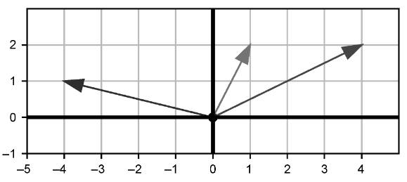

**练习3.12：**(-1, -1, 1)和(1, 2, 1) 的点积是多少？这两个三维向量的夹角是大于90°、小于 90°，还是正好等于90°？

**练习3.13（小项目）：**对于两个三维向量u和v，(2u) * v和u * 2v的值都等于2(u * v)。在这种情况下，u * v = 18，而(2u) * v和u * 2v都是36，是原结果的2倍。请证明这个规则对于任意实数s都适用，而不仅仅是2。换句话说，请证明对于任意s，(su) * v和u * (sv)的值都等于s(u * v)。

**练习3.14（小项目）：**用代数证明向量与其自身的点积是其长度的平方。

**练习3.15（小项目）：**找出长度为3的向量u和长度为7的向量v，使u * v = 21。再找出一对向量u和v，使u * v = -21。最后，再找出三对长度分别为3和7的向量，并证明它们的长度都在-21和21之间。

**练习3.16：**设u和v是向量，其中|u|=3.61，|v|=1.44。如果u和v的夹角是101.3°，那么u*v是什么？

**练习3.17（小项目）：**通过把(3, 4)和(4, 3)转换为极坐标并取角的差值，来求出它们之间的角度。答案是以下哪一个？

(a) 1.569(b) 0.927(c) 0.643(d) 0.284

**练习3.18：**(1, 1, 1)与(-1, -1, 1)之间的角是多少度？

### 向量积：测量定向区域

**练习3.19：**如图3-45所示，各图中都存在三个相互垂直的箭头，分别表示X轴、Y轴和Z轴的正方向。在这些显示为三维框的透视图中，框的背面是灰色的。四幅图中的哪一个与我们选择的相符？也就是说，哪张图显示了我们所画的X轴、Y轴和Z轴，即使从不同的角度来看也是如此？
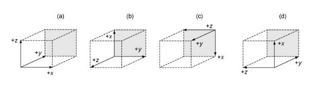

**练习3.20：**如果把三条坐标轴立在镜子前，镜子里图像的方向是相同的还是不同的呢？

**练习3.21：**(0, 0, 3) × (0, -2, 0)的结果指向什么方向？

**练习3.22：**(1, -2, 1)和(-6, 12, -6)向量积的坐标是多少？

**练习3.23（小项目）：**如图3-47所示，平行四边形的面积等于它的底边长乘以它的高。
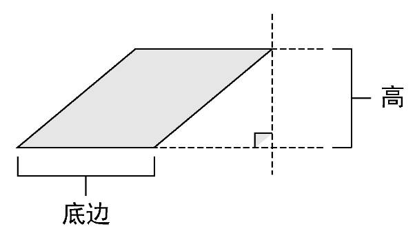

**练习3.24：**向量积(1, 0, 1) × (-1, 0, 0)的结果是什么？

(a) (0, 1, 0)(b) (0, -1, 0)(c) (0, -1, -1)(d) (0, 1, -1)

**练习3.25：**使用Python的cross函数计算(0,0,1) * v，其中第二个向量v是几个不同的值。每个结果的Z坐标是多少，为什么？

**练习3.26（小项目）：**用代数法证明u * v垂直于u和v，不管u和v的坐标是多少。

### 在二维平面上渲染三维模型

**练习3.27（小项目）：**找到定义八面体12条边的向量对，并用Python绘制出所有的边。

**练习3.28：**八面体的第一个面是[(1, 0, 0), (0, 1, 0), (0, 0, 1)]。这是定义该面顶点的唯一有效顺序吗？

## 变换向量与图形

### 变换三维对象

**练习4.1：**实现一个translate_by函数（4.1.2节中有所提及），以一个平移向量作为输入并返回一个平移函数作为输出。

**练习4.2：**渲染沿Z轴负方向平移了20个单位的茶壶，产生的图像是什么样的？

**练习4.3（小项目）：**当按0和1之间的标量缩放每一个向量时，茶壶会发生什么变化？按系数-1缩放，又会发生什么变化？

**练习4.4：**对茶壶首先应用translate1left，然后应用scale2。结果与相反的组合顺序有什么不同？为什么会这样？

**练习4.5：**compose(scale_by(0.4), scale_by(1.5))变换的效果是什么？

**练习4.6：**将compose(f,g)函数修改为compose(*args)，它将几个函数作为参数，并返回一个新的函数，即它们的组合。

**练习4.7：**实现函数curry2(f)，接收一个有两个参数的Python函数f(x,y)，并返回一个柯里化版本。例如，对于g = curry2(f)，f(x,y)和g(x)(y)应该返回相同的结果。

**练习4.8：**在不执行代码的情况下，说出变换compose(rotate_z_by(pi/2),rotate_x_by(pi/2))的结果是什么。如果换一下组合的顺序呢？

**练习4.9：**实现函数stretch_x(scalar,vector)，只在X方向上将目标向量按给定系数缩放。同时实现stretch_x_by的柯里化版本，使stretch_x_by(scalar)(vector)返回同样的结果。

### 线性变换

**练习4.10：**再考虑对所有坐标执行二次方运算的向量变换S，用代数方法证明S(sv) = sS(v)并不是对所有标量s和二维向量v都成立。

**练习4.11：**假设T是一个向量变换，且T(O)!=0，其中O代表所有坐标都等于零的向量。根据定义，为什么T是非线性的？

**练习4.12：恒等变换**是返回向量与接收向量相同的向量变换，用大写的I表示。因此，对于所有向量v，其定义写成I(v)=v。为什么I是一个线性变换？

**练习4.13：**(5, 3)和(-2, 1)之间的中点是什么？把这三个点都画出来，看看你的做法是否正确。

**练习4.14：**再考虑把v=(x,y)转移到(x²,y²)的非线性变换S(v)。用第2章的绘图代码将整数坐标为0～5的36个向量v全部绘制成点，然后分别绘制它们的S(v)。在v的作用下，向量在几何上会发生什么？

**练习4.15（小项目）：基于属性的测试**是一种单元测试，涉及为程序创造任意输入数据，然后检查输出是否满足所需条件。一些流行的Python库，如Hypothesis（可通过pip获得），可以很容易地配置它。使用你选择的库，实现基于属性的测试来检查向量变换是否是线性的。

具体来说，给定一个以Python函数形式实现的向量变换T，生成大量随机向量对，并对所有这些向量断言，T会保持它们的和。然后，对每组标量和向量做同样的事情，来确定T保持了标量乘积。应该可以发现，像rotate_x_by(pi/2)这样的线性变换可以通过测试，但是像坐标-平方变换这样的非线性变换不能通过。

**练习4.16：**二维向量变换是相对于X轴的**镜像**，这种变换接收一个向量并返回其相对于X轴的镜像向量。它应该保持X坐标不变，改变Y坐标符号。将这种变换称为Sₓ，图4-43展示了向量v=(3,2)和变换后的向量Sₓ(v)。
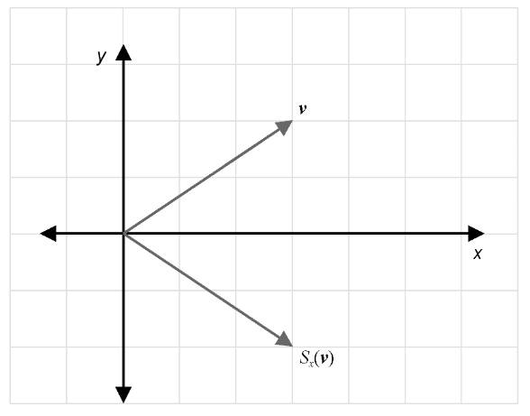

**练习4.17（小项目）：**假设S和T都是线性变换。解释为什么S和T的组合也是线性的。

**练习4.18：**设T是Python函数rotate_x_by(pi/2)所做的线性变换，那么T(e1)、T(e2)和T(e3)分别是什么？

**练习4.19：**实现函数linear_combination(scalars, *vectors)，接收一个标量列表和相同数量的向量，并返回一个向量。例如，linear_combination([ 1,2,3], (1,0,0), (0,1,0), (0,0, 1))应该返回1 * (1,0,0) + 2 * (0,1,0) + 3 * (0,0,1)，即(1, 2, 3)。

**练习4.20：**编写函数transform_standard_basis(transform)，将一个三维向量变换作为输入，并输出它对标准基的影响。它应该输出一个由3个向量组成的元组，这些向量是transform分别作用于e1、e2和e3的结果。

**练习4.21：**假设B是一个线性变换，满足B(e1)=(0,0,1)、B(e2)=(2,1,0)、B(e3)=(-1,0,-1)和v=(-1,1,2)。B(v)是什么？

**练习4.22：**假设A和B都是线性变换，而且A(e1)=(1,1,1)、A(e2)=(1,0,-1)、A(e3)=(0,1,1)、B(e1)=(0,0,1)、B(e2)=(2,1,0)、B(e3)=(-1,0,-1)。那么A(B(e1))、A(B(e2))和A(B(e3))是什么？

## 使用矩阵计算变换

### 用矩阵表示线性变换

**练习5.1：**实现函数infer_matrix(n, transformation)，接收一个维度参数（比如2或3）和一个线性向量变换的函数参数，返回n * n方阵（一个n元组的n元组的数字集，表示线性变换的矩阵）。当然，只有当输入变换是线性时，输出才有意义；否则，表示的将是一个完全不同的函数！

**练习5.2：**如下2 × 2矩阵与二维向量的乘积结果是什么？((1.3,0.7)(6.5,3.2))((-2.5)(0.3))

**练习5.3（小项目）：**实现random_matrix函数，用随机整数项生成指定大小的矩阵。使用该函数生成5对3 × 3矩阵。手动将每对矩阵相乘（用于练习），然后使用matrix_multiply函数来检查结果是否一致。

**练习5.4：**对于上一个练习中的每一组矩阵，按相反的顺序相乘，得到的结果一样吗？

**练习5.5：**在二维或三维中，有一个枯燥但重要的向量变换，叫作**恒等变换**，它接收一个向量并返回相同的向量。这种变换是线性的，因为它接收任意向量和、标量乘积或线性组合，并返回相同的东西。在二维和三维中，分别表示恒等变换的矩阵是什么？

**练习5.6：**对所有定义茶壶的向量应用矩阵((2, 1, 1), (1, 2, 1), (1,1, 2))。茶壶会发生什么情况，为什么？

**练习5.7：**使用两个嵌套推导式以不同的方式实现multiply_matrix_vector：一个遍历矩阵的行，另一个遍历每一行的项。

**练习5.8：**利用输出坐标是输入矩阵行与输入向量的点积这一事实，用另一种方式实现multiply_matrix_vector。

**练习5.9（小项目）：**我首先告诉了你什么是线性变换，然后展示了任意线性变换都可以用矩阵来表示。现在来证明相反的事实：所有矩阵都表示线性变换。从二维向量乘以2 × 2矩阵或三维向量乘以3 × 3矩阵的显式公式开始，用代数法证明这一点。也就是说，证明矩阵乘法前后，向量和与标量乘积保持不变。

**练习5.10：**再一次使用5.1.3节中的两个矩阵。

A=[[1,1,0],[1,0,1],[1,-1,1]]

B=[[0,2,1],[0,1,0],[,1,0,-1]]

实现函数compose_a_b，执行A的线性变换和B的线性变换的组合，然后用本节前面练习中的infer_matrix函数来证明infer_matrix(3,compose_a_b)与矩阵积AB相同。

**练习5.11（小项目）：**找出两个2 × 2矩阵，它们都不是单位矩阵I₂，但其乘积是单位矩阵。

**练习5.12：**方阵可以与自身相乘任意次数。可以把连续的矩阵乘法看作“取一个矩阵的幂”。对于方阵A，可以把AA写成A²，把AAA写成A³，以此类推。实现matrix_power(power, matrix)函数，取指定整数的矩阵的幂。

### 不同形状矩阵的含义

**练习5.13：**这个矩阵的维度是什么？

[[1,2,3,4,5],[6,7,8,9,1],[11,12,13,14,15]]

(a) 5 × 3(b) 3 × 5

**练习5.14：**将二维列向量看作矩阵时，其维度是多少？二维行向量呢？三维列向量呢？三维行向量呢？

**练习5.15（小项目）：**我们的许多向量和矩阵操作使用了Python的zip函数。当给定不同大小的输入列表时，这个函数会截断两个列表中较长的那个，而不是直接失败。这意味着，当我们传递无效输入时，会得到无意义的结果。例如，在二维向量和三维向量之间并不存在点积，但我们的dot函数还是返回了一些东西。

~~~python
>>> from vectors import dot
>>> dot((1,1),(1,1,1))
2
~~~

给所有的向量运算函数添加保护措施，以便函数能够抛出异常，而不是返回无效大小的向量值。一旦完成了这些工作，就可以证明matrix_multiply不再接收3 × 2和4 × 5矩阵的乘积。

**练习5.16：**以下哪些是有效的矩阵乘积？对于那些有效的矩阵乘积，乘积矩阵的维度是多少？

(a) [[10,0],[3,4]] [[8,2,3,6],[7,8,9,4],[5,7,0,9],[3,3,0,2]]
(b) [[0,2,1,-2],[-2,1,-2,-1]] [[-3,-5],[1,-4],[-4,-4],[-2,-4]]
(c) [[1],[3],[0]] [3,3,5,1,3,0,5,1]
(d) [[9,2,3],[0,6,8],[7,7,9]] [[7,8,9],[10,7,8]]

**练习5.17：**将一个总项数为15的矩阵与一个总项数为6的矩阵相乘。两个矩阵的维度分别是多少？乘积矩阵的维度又是多少？

**练习5.18：**实现一个函数，将列向量转换成行向量，或者将行向量转换成列向量。像这样把一个矩阵翻转过来叫作**转置**，而得到的矩阵叫作原矩阵的**转置矩阵**。

**练习5.19：**画图说明10 × 8矩阵和5 × 8矩阵**不能**以该顺序相乘。

**练习5.20：**将如下三个矩阵相乘：A是5 × 7矩阵，B是2 × 3矩阵，C是3× 5矩阵。这三个矩阵能以什么顺序相乘？结果矩阵的大小又是多少？

[[1,0,0],[0,1,0],[0,0,1]]

**练习5.21：**将如下矩阵投影到YZ平面上和投影到XZ平面上都是从三维到二维的线性映射。它们的矩阵分别是什么？

**练习5.22：**举例说明之前练习中的infer_matrix函数可以为具有不同维度的输入和输出线性函数创建矩阵。

**练习5.23：**编写一个4 × 5矩阵，通过删除五项中的第三项来作用于五维向量，从而产生一个四维向量。例如，用(1, 2, 3, 4, 5)的列向量形式与它相乘，应该返回(1, 2, 4, 5)。

**练习5.24（小项目）：**考虑6个变量组成的向量(l,e,m,o,n,s)。找出作用于这个向量的线性变换的矩阵，它能产生向量(s,o,l,e,m,n)作为结果。

提示：输出的第三个坐标等于输入的第一个坐标，所以变换必须将标准基向量(1, 0, 0, 0, 0, 0)转换成(0, 0, 1, 0, 0, 0)。

**练习5.25：**从5.2.5节中的矩阵M、N、P和Q可以得到哪些有效的乘积？将矩阵与自身的乘积也纳入考虑。对于那些有效的乘积，矩阵乘积的维度又是多少？

**练习5.26：**证明如果把二维图形（例如我们一直使用的恐龙）移动到Z = 2平面上，三维“神奇”矩阵变换将不起作用。那么会发生什么呢？

**练习5.27：**构造一个矩阵，将恐龙在X方向上平移-2个单位，在Y方向上平移-2个单位，执行变换并显示结果。

**练习5.28：**证明如下形式的任何矩阵：

[[a,b,c],[d,e,f],[0,0,1]]

都不会影响它所乘的三维列向量的Z坐标。

**练习5.29（小项目）：**找出一个3 × 3矩阵，将Z=1平面上的二维图形旋转45°，将其尺寸缩小1/2并平移(2, 2)。通过将该矩阵应用于恐龙的顶点来演示其工作原理。

**练习5.30：**之前练习中的矩阵使恐龙旋转45°，然后将其平移了(3, 1)。使用矩阵乘法，构建一个与之顺序相反的矩阵。

**练习5.31：**实现一个类似于translate_3d的函数，称为translate_4d。该函数使用一个5 × 5矩阵通过一个四维向量平移另一个四维向量。运行一个示例来说明坐标会被平移。

## 高维泛化

### 泛化向量的定义

**练习6.1：**实现继承自Vector的类Vec3。

**练习6.2（小项目）：**实现一个继承自Vector的类CoordinateVector，添加一个代表维度的抽象属性，以此节省因为坐标维度不同而带来的重复工作。从CoordinateVector继承并将维度设置为6就能实现类Vec6。

**练习6.3：**在Vector类中添加一个zero抽象方法，以返回给定向量空间中的零向量，并且实现取反运算符。有了这两样，向量空间就有了零向量，并能对其中的任意向量取反。

**练习6.4：**为Vec3编写单元测试，以证明它的向量加法和标量乘法运算满足向量空间属性。

**练习6.5：**对于任意向量v，增加单元测试来证明O + v = v、0 * v = 0和-v + v = O，其中的0是数，O是零向量。

**练习6.6：**由于Vec2和Vec3实现了==运算符重载，结果是Vec2(1,2) ==Vec3(1,2,3)返回True。Python的鸭子类型（duck typing）看起来太宽容了！通过添加一个检查来解决这个问题：在测试向量相等性之前，确认类型必须一致。

**练习6.7：**在Vector上实现一个__truediv__方法，允许你用向量除以标量。将向量乘以标量的倒数（1.0/标量），就可以将向量除以非零标量。

### 探索不同的向量空间

**练习6.8：**用u、v和w三个浮点值代替继承自Vector类的对象进行向量空间的单元测试，证明实数确实是向量。

**练习6.9（小项目）：**对CarForSale进行向量空间的单元测试，证明它的对象形成了一个向量空间（忽略其文本属性）。

**练习6.10：**实现Function(Vector)类，只接收一个变量的函数作为其构造函数的参数，并实现__call__方法，以便将其作为一个函数来处理。应该可以执行plot([f,g,f+g,3*g], -10,10)这样的代码。

**练习6.11（小项目）：**测试函数的相等性是一件困难的事情，但请尽力写一个函数来测试两个函数是否相等。

**练习6.12（小项目）：**对Function类进行单元测试，证明函数满足向量空间的属性。

**练习6.13（小项目）：**实现类Function2(Vector)，表示带有两个变量的函数，如f(x,y)=x+y。

**练习6.14：**9 × 9矩阵的向量空间的维度是多少？

**练习6.15（小项目）：**实现一个继承自Vector的类Matrix，用抽象属性表示行列数。虽然无法实例化一个Matrix类，但可以通过继承Matrix并明确指定行列数来创建Matrix5_by_3类。

**练习6.16：**对Matrix5_by_3类进行单元测试，证明它满足向量空间的定义。

**练习6.17（小项目）：**编写一个继承自Vector的类LinearMap3d_to_5d，使用5 × 3矩阵作为数据源，编写__call__方法来实现从R³到R⁵的线性映射。证明它在计算方式上与Matrix5_by_3一致，并证明它也满足向量空间的定义。

**练习6.18（小项目）：**编写一个能够对Matrix5_by_3对象和Vec3对象运行矩阵乘法的Python函数。对向量和矩阵类的*运算符进行重载，以便将变量或矩阵与向量相乘。

**练习6.19：**证明ImageVector类的零向量和图像相加时不会明显改变任何图像。

**练习6.20：**选择两幅图像并按照不同比例进行加权平均运算，生成10幅不同的图像。所生成图像上的点即为在27万维空间中的两幅图像上像素点的线性组合！

**练习6.21：**将针对向量空间的单元测试修改为适用于图像的，看看如何为单元测试生成随机图像。

### 寻找更小的向量空间

**练习6.22：**从几何角度证明为什么如图6-30所示的区域S不是该平面的向量子空间。
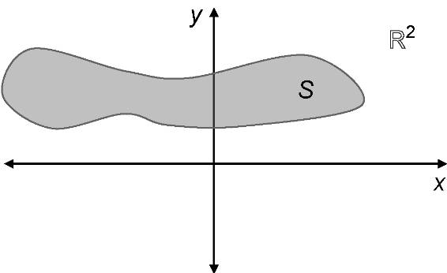

**练习6.23：**证明X=0的平面区域构成一维向量空间。

**练习6.24：**尝试把向量(1, 0)、(1, 1)和(-1, 1)中的每个写成另外两个向量的线性组合，证明它们是线性相关的。

**练习6.25：**证明任意向量(x,y)是(1, 0)和(1, 1)的线性组合。

**练习6.26：**给定一个向量v，解释为什么v所有线性组合的集合与v所有标量乘积的集合相同。

**练习6.27：**从几何的角度证明为什么一条不通过原点的直线不是（二维平面或三维空间的）向量子空间。

**练习6.28：**{e1,e2,e3}中的任意两个都无法生成R³，只能生成一个三维空间的二维子空间，那么这些子空间是什么？

**练习6.29：**把向量(-5, 4)写成(0, 3)和(-2, 1)的线性组合。

**练习6.30（小项目）：**(1, 2, 0)、(5, 0, 5)和(2, -6, 5)之间是线性相关还是线性无关的？

**练习6.31：**解释为什么线性函数f(x) = ax + b不是从向量空间到其自身的线性映射，除非b = 0。

**练习6.32：**重新实现LinearFunction类，从Vec2继承并实现__call__方法。

**练习6.33：**（用代数方式）证明f(x)=ax + b形式的线性函数构成所有函数向量空间的向量子空间。

**练习6.34：**找出3 × 3矩阵的基，这个向量空间的维度是多少？

**练习6.35（小项目）：**实现类QuadraticFunction(Vector)来表示ax² + bx + c形式的函数生成的向量子空间。这个子空间的基是什么？

**练习6.36（小项目）：**{4x+1,x-2}是线性函数的基，请尝试把-2x + 5写成这两个函数的线性组合。

**练习6.37（小项目）：**所有多项式的向量空间是一个无限维的子空间。将该向量空间实现为一个类，并找出它的基（必须是一个无限集合）。

**练习6.38：**本章向你展示了27万维图像空间的基向量的伪代码，那么第二个基向量是什么样的？

**练习6.39：**编写函数solid_color(r,g,b)，返回一个纯色的ImageVector，为每个像素指定红、绿、蓝的具体数值。

**练习6.40（小项目）：**通过对每个像素的亮度（红、绿、蓝的平均值）进行平均，实现将300 × 300的图像转换成30 × 30灰度图像的线性映射函数。接下来实现一个线性映射函数，从30 × 30的灰度图像还原出一个新的ImageVector。

## 求解线性方程组

### 设计一款街机游戏

**练习7.1：**在PolygonModel上实现transformed()方法。该方法返回由对象的X属性和Y属性转换并由rotation_angle属性旋转的模型的点。

**练习7.2：**实现一个函数to_pixels(x,y)。该函数取正方形中的一对坐标X和Y，其中-10 < X < 10以及-10 < Y < 10，并将它们映射到对应的PyGame X和Y像素坐标，每个坐标的范围为0到400。

### 找到直线的交点

**练习7.3：**u + t * v可能是一条穿过原点的直线。在这种情况下，向量u和v有什么特征？

**练习7.4：**如果v = O = (0,0)，u + t * v形式的点是否表示一条直线？

**练习7.5：**结果证明公式u + t * v不是唯一的；也就是说，可以取不同的u和t来表示同一条直线。那么，另一条表示(2,2) + t * (-1,3)的直线是什么？

**练习7.6：**对任意a、b和c的值，方程a * x + b * y = c是否都能表示一条直线？

**练习7.7：**求直线2x + y = 3的另一个方程，证明a、b、c不是唯一的。

**练习7.8：**方程a * x + b * y = c等价于包含两个二维向量的点积的方程：(a,b)(x,y) = c。因此，可以说一条直线是一组向量，与给定向量的点积是常数。这一表述的几何解释是什么？

**练习7.9：**向量(0, 7)和(3.5, 0)是否都满足方程2x + y = 7。

**练习7.10：**画出(3,0) + t(0,1)的图形，并用公式将其转化为标准形式。

**练习7.11：**编写一个Python函数standard_form，该函数接收两个向量v1和v2并找到通过这两个向量的直线ax + by = c。

**练习7.12（小项目）：**对于do_segments_intersect中的四项距离检查中的每一项，找到一对线段，它们未通过其中一项检查，但通过了其他三项检查。

**练习7.13：**对于激光线和小行星的例子，确认does_intersect函数返回True。（提示：使用网格线找到小行星的顶点并创建一个代表小行星的PolygonModel对象。）

**练习7.14：**实现does_collide(other_polygon)方法，通过检查定义两个多边形的任何线段是否相交来确定当前PolygonModel对象是否与other_polygon发生碰撞。这可以帮助我们确定小行星是撞击了飞船还是撞击了另一颗小行星。

**练习7.15（小项目）：**我们无法找到一个向量w，使下面的方程组有唯一解v。

[[2,1],[4,2]]v = w

找到一个向量w，使该方程组具有无穷多个解；也就是说，有无穷多个v值满足这个方程组。

### 将线性方程泛化到更高维度

**练习7.16：**通过(5, 4)并垂直于(-3, 3)的直线方程是什么？

**练习7.17（小项目）：**思考四维中的如下两个线性方程。

x₁ + 2x₂ + 2x₃ + x₄ = 0

x₁ - x₄ = 0

用代数法（而不是几何法）解释，为什么方程组的解会形成四维的向量子空间。

**练习7.18：**通过点(1, 1, 1)并垂直于向量(1, 1, 1)的平面的标准方程是什么？

**练习7.19（小项目）：**写一个Python函数，输入是三个三维点，返回它们所在平面的标准方程。例如，如果标准方程是ax + by + cz = d，则函数可以返回元组(a,b,c,d)。

提示：三个向量中任何一对向量的差都是平行于平面的，所以向量差的向量积是垂直的。

**练习7.20：**如图7-30所示的矩阵方程中共有多少个常数aᵢⱼ？有多少个方程？有多少个未知数？写出完整的矩阵方程和完整的线性方程组（无省略号）。
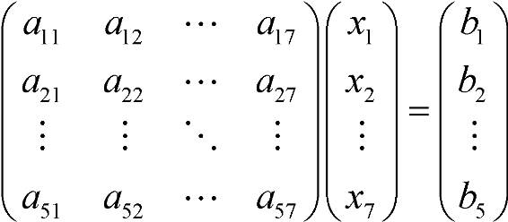

**练习7.21：**写出线性方程来替代如下求和简写。在几何上，线性方程的解是什么样的？

**练习7.2：**

**练习7.2：**

**练习7.2：**

**练习7.2：**

**练习7.2：**

**练习7.2：**

**练习7.2：**